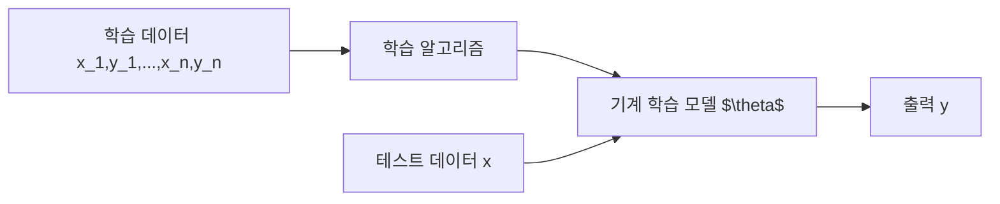
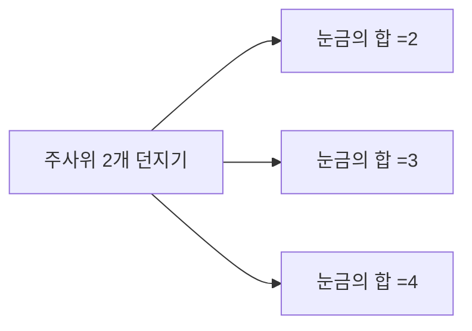

# 확률이란
- 특정한 사건이 일어날 가능성을 수로 표현한 것을 의미
- 0에서 1까지의 수로 표현됨

## 사용되는 예시
- 스팸 메일 분류모델에서 메일이 총 1000통이고 스팸 메일이 200개이면 새로온 메일이 스팸메일인 확률을 0.2

## 기계학습 모델을 확률적으로 이해
- N개의 학습 데이터로 기계학습 모델을 학습
- 일반적으로 기계학습 모델의 출력은 확률을 띤다.
  - 예 1) 이미지 분류 모델 $\theta$가 이미지 $x$에 대해서 75%의 확률로 고양이 일것이다 라고 예측했다.
  - 예 2) 글 쓰기 모델 $\theta$는 "나는 밥을" 이후에 "먹었다"라는 단어가 나올 확률을 42%로 예측



## 경우의 수
- 경우의 수를 계산하는 방법으로는 일반적으로 순열(permutation)과 조합(combination)이 있다.

### 순열(Permutations)
- 서로 다른 n개에서 r개를 중복 없이 뽑아 특정한 순서로 나열하는 것을 의미
- 순열의 수 공식 $(n=r)$일때
  - $_nP_r=n!$ 
- 순열의 수 공식 $(n \neq r)$
  - $_nP_r=\frac{n!}{(n-r)!}$
```python
from itertools  import permutations

arr = ['A','B','C']
# 원소 중에서 2개를 뽑는 모든 순열 계산
result = list(permutations(arr,2))
print(result)
```

### 조합(Combinations)
- 서로 다른 n개에서 r개를 중복 없이 순서를 고려하지 않고 뽑는 것을 의미
- 모든 조합의 수(경우의 수)는 다음의 공식으로 계산 가능
- 조합의 수 공식

  $$_nC_r = \frac{n!}{r!(n-r)!} = _nC_{n-r}$$
  
```python
from itertools import combinations

arr = ['A','B','C']
# 위의 행렬에서 2개를 뽑는 모든 조합 계산
result = list(combinations(arr,2))
```

### 중복 순열(Permutation with Repetition)
- 서로 다른 n개에서 중복을 포함해 r개를 뽑아 특정한 순서로 나열한 것을 의미
- 중복 순열의 수 공식
  - $_n\Pi_r = n^r$
```python
from itertools import product

arr = ['A','B','C']
# 원소 중에서 2개를 뽑는 모든 중복 순열 계산
result = list(product(arr,2))
print(result)
```

### 중복 조합(Combination with Repetition)
- 서로 다른 n개에서 중복을 포함하지 않음 순서를 고려하지 않고 r개를 뽑는 것을 의미한다.
- 중복 조합의 수 공식
  - $_nH_r = _{n+r-1}C_r$
- 예시) 딥러닝 앙상블(ensemble) 방법이 존재

```python
from itertools import combinations_with_replacement
arr = ['A','B','C']
# 원소 중에서 2개를 뽑는 모든 중복 조합 계산
retulr = list(combinations_with_replacement(arr,2))
print(result)
```

## 확률(Probability)
- $S$를 전체 사건(event)의 집합(표본 공간 = sample space)라고 한다.
- 사건 $X$가 일어날 확률(probability) $P(X)$는 다음과 같음
- $P(X)-$ 사건 $X$가 일어나는 경우의 수 / 전체 경우의 수 = $n(X)/n(S)$
  - 앞면에 1, 뒷면에 0이 쓰여있는 2개의 동전을 2번 던졌을 때, 눈금의 합이 1일 확률은? 1/3

## 시행(Trial)과 사건(Event)
- 확률에 대하여 이해하기 위해서, 먼시 시행(Trial)과 사건(Event)에 대해 알아야 한다.
- 시행(Trial): 반복할 수 있으며, 매번 결과가 달라질 수 있는 실험 ex) 주사위를 2개를 던지는 행동
- 사건(Event): 시행에 따른 결과를 의미 ex) 눈금의 합이 7이 되는 사건


## 확률 변수(Random Variable)
- 확률 변수란, 사건으로 인해 그 값이 확률적으로 정해지는 변수를 의미
- 주사위 2개를 던지는 시행을 할 때마다 눈금의 합이 변함
- 따라서 확률 변수 = 눈금의 합으로 표현할 수 있다.
- 확률 변수는 대문자 X로 표기하고, 확률 변수가 취할 수 있는 값은 소문자 x로 표현

## 확률 함수(Probability Function)
- 앞서 확률 변수란, 시행할 때마다 변할 수 있는 값(눈금의 합)이라고 한다.
- 확률 함수란, 확률 변수에 따라서 확률 값을 부여하는 함수를 말함
- 확률 함수는 일반적으로 P라고 표현
- 주사위 두 개 던지기(시행)을 했을 때 눈금의 합이 3이 나올 확률은 1/36이다.
- $P(X=3)=1/36$

## 확률 변수는 함수다?
- **표본 공간(sample space)**: 발생 가능한 모든 사건들의 집합(전체 집합)
- 확률 변수는 표본 공간 안에서 특정 확률로 발생하는 사건을 특정한 수치에 대응시키는 함수이다.
- 이때 확률 변수가 취할 수 있는 모든 값 x의 집합을 상태 공간(state space)이라고 한다.

## 확률 분포(Probability Distribution)
- 확률 분포(probability distribution)란?
- 각 사건에 어느 정도의 확률이 할당되었는지 표현한 정보를 의미
- 확률 분포를 통해 통계적인 특성을 쉽게 이해

[예시](https://en.wikipedia.org/wiki/Normal_distribution)

## 확률 분포 함수(Probability Distribution Function)
- 확률 변수 X가 가지는 값 x에 확률 P(X=x)를 대응시키는 함수를 의미한다.
- 모든 사건에 대하여 확률 분포 함수의 값을 표현한 것을 확률 분포로 이해할 수 있다.


## 이산 확률 분포
- 확률변수 X가 취할 수 있는 모든 값을 셀 수 있는 경우, 이를 이산확률변수라고 한다.
- 이때 이산확률분포는 이산확률변수의 확률 분포를 의미한다.
- 주사위 여러개를 던졌을때 합으로 나올 수 있는 눈금

## 확률 질량함수(Probability Mass Function, PMF)
- 확률질량함수는 이산확률변수가 특정한 값을 가질 확률을 출력하는 함수다.
- 확률질량함수는 이산확률분포를 표현하기 위해 사용하는 확률분포함수로 이해할 수 있다.
  - 동전 2개를 동시에 던지는 시행에서 두 눈금의 합을 X라고 한다.
    - $f(0) = P(X=0) = 1/4$
    - $f(1) = P(X=1) = 1/2$
    - $f(2) = P(X=2) = 1/4$
  - 확률 변수 X에 대한 확률질량함수라는 의미로 $f_x(x)$라고 표기하기도 한다.
  


### 베르누이 시행(Bernoulli Trial)
- 결과가 두 가지 중 하나로만 나오는 시행을 베르누이 시행이라고 한다.
  - 예) 입학시험, 동전 던지기
  
#### 베르누이 확률변수
- 베르누이 시행의 결과를 실수 0 혹은 1로 나타낸다.
- 확률 변수는 0 혹은 1의 값만 가질 수 있으므로, 이산확률변수이다.
- 베르누이 확률변수의 분포를 베르누이 확률분포라고한다.
- 확률변수 X가 베르누이 분포를 따른다고 표현하며, 수식으로는 다음과 같이 표현
- $X~Bern(x;\mu)$
  - 모수(parameter)는 세미콜론(;) 기호로 구분하여 표기
  - 베르누이 확률분포는 모수로 $\mu$를 가지는데, 1이 나올 확률을 의미한다.
 
 $$ Bern(x;\mu)=
 \begin{cases}
 \mu,& \mbox{if }x=1 \\ 
 1-\mu, &\mbox{if }x=0 
 \end{cases}$$
 
 - 이는 아래와 같은 하나의 수식으로 표현 가능
 - $Bern(x;\mu)=\mu^x(1-\mu)^{1-x}$


 

### 이항 분포 개요
- 베르누이 시행을 N번 반복하는 경우가 있음
- 성광 확률이 $\mu$인 베르누이 시행을 N번 반복
- N번 중에서 성공한 횟수를 확률 변수 X라고 한다.
- X는 0부터 N까지의 정수 중 하나이다.
- 이러한 확률 변수를 이항 분포를 따른다고 한다.
$X~Bin(x;N,\mu)$
- 이항 분포는 모수(parameter)로 N과 $\mu$를 가진다.
  - 파라미터 1: 시행횟수 N
  - 파라미터 2: 한 번의 횟수에서 1이 나올 확률 $\mu$
- 이항 분포 확률 변수 X의 확률 질량 함수는 다음과 같다.
$X~Bin(x;N,\mu)={N \choose x}\mu^x(1-\mu)^{N-x}$
- 단, ${N \choose x}$는 N개에서 x개를 선택하는 조합(combination)의 수와 같다.
- 단, $N!=N\dot (N-1)... 2\dot 1$

### 이항 분포 예시문제
- 가구 공장에서 가구 만들 때, 불량률이 10%라고 한다.
- 이 공장에서 만든 가구 10개를 확인했을 때, 불량품이 2개 이하로 나올 확률을 구하여라
- 불량률 10% -> p = 10%
  - 불량률이 0개, 1개, 2개일 이항분포를 구한다.
  - ${10 \choose 0}p^0\times(1-0.1)^10 + {10 \choose 1}p^1 \times (1-0.1)^9 + {10 \choose 2}p^2 \times (1-0.1)^8$

### 포아송 분포
- 일정한 시간 내 발생하는 사건의 발생 횟수에 대한 화귤ㄹ을 계산할 때 사용
- 단위 시간에 어떤 사건이 발생할 기대값이 $\lambda$일 때, 그 사건이 x회 일어날 확률을 구할 수 있다.
- 포아송 분포는 푸아송분포라고 부르기도 한다.
$$f(x;\lambda)=\frac{e^{-\lambda}\lambda^x}{x!}$$
- 포아송 분포의 평균을 $\lambda$로 표기한다.
- e는 자연 상수를 의미한다 (e=2.718...)
- 단위 시간 내 평균 발생 횟수($\lambda$)가 5일 때, 그 사건이 8회 일어날 확률은?


## 연속확률변수(Continous Random Variable)
- 확률 변수 X가 취할 수 있는 값이 무한한 경우, 이를 연속확률변수라고 한다.
- 연속적인 값의 예시: 키, 달리기, 성적...

## 확률밀도함수 (Probability Density Function, PDF)
- 확률밀도함수(probability density function)란?
- 연속확률변수가 주어진 구간 내에 포함될 확률을 출력하는 함수
  예) 정규분포
  


## 연속확률분포의 성질
- 확률 변수 X가 어떠한 구간에 속할 확률은 0과 1 사이이다.
- 확률 변수 X가 값을 가질 수 있는 모든 구간의 확률을 합치면 1이다 (전체 면적 = 1)
  - 단, 각 구간은 배반(서로 겹치는 게 없을 때) 관계일 때 이것이 성립한다.
$$\int_{-\inf}^{\inf}f(x)dx=1$$ 전체 면접의 합은 1
$$P(a\le X \le b) = \int_a^b f(x)dx$$ a부터 b까지의 면적

### 균등 분포(Uniform Distribution)
- 가장 단순한 연속확률분포로, 특정 구간 내 값들이 나타날 가능성이 균등하다.
- 다시 말해, 모든 확률변수에 대해 일정한 확률을 가지는 확률 분포다.
- X가 균등 분포를 따를 때 $X~U(a,b)$로 표현한다.
- X는 a에서 b 사이에서 일정한 값을 취하고 $P(a \le X \le b)=1$이다.
$$f(x) = 
\begin{cases} 
\frac{1}{b-a} & a\le X \le B \\ 
0 & \mbox{otherwise} 
\end{cases}$$
- 균등 분포는 직사각형 형태를 보인다.


### 정규 분포
- 정규 분포는 기계학습 분야에서 매우 자주 등장
- 정규 분포는 밥그릇과 같은 모양을 보임


- 정규 분포의 모양은 평균과 표준편차로 결정된다.
- 확률밀도함수는 평균을 중심으로 좌우 대칭인 종 모양을 형성한다
- 관측되는 값의 약 98%가 $\pm 2 \sigma$ 범위 안에 속한다.


- 평균에 따라서 정규 분포가 좌우로 평행이동한다.


### 정규 분포의 특징 - 분산
- 분산이 클수록 정규 분포가 옆으로 넓게 퍼지게 된다.
- 분산이 작을수록 정규 분포는 가파른 모양을 가진다.


 


