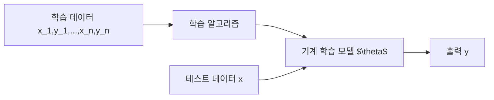
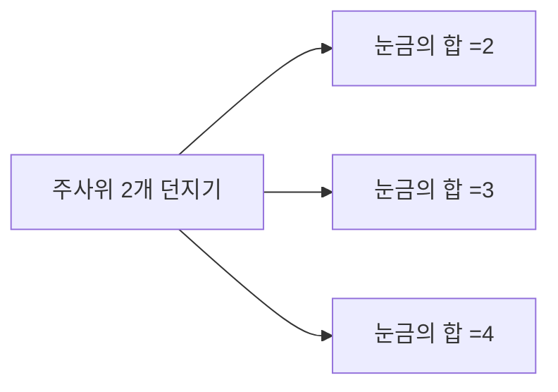

# 확률이란
- 특정한 사건이 일어날 가능성을 수로 표현한 것을 의미
- 0에서 1까지의 수로 표현됨

## 사용되는 예시
- 스팸 메일 분류모델에서 메일이 총 1000통이고 스팸 메일이 200개이면 새로온 메일이 스팸메일인 확률을 0.2

## 기계학습 모델을 확률적으로 이해
- N개의 학습 데이터로 기계학습 모델을 학습
- 일반적으로 기계학습 모델의 출력은 확률을 띤다.
  - 예 1) 이미지 분류 모델 $\theta$가 이미지 $x$에 대해서 75%의 확률로 고양이 일것이다 라고 예측했다.
  - 예 2) 글 쓰기 모델 $\theta$는 "나는 밥을" 이후에 "먹었다"라는 단어가 나올 확률을 42%로 예측



## 경우의 수
- 경우의 수를 계산하는 방법으로는 일반적으로 순열(permutation)과 조합(combination)이 있다.

### 순열(Permutations)
- 서로 다른 n개에서 r개를 중복 없이 뽑아 특정한 순서로 나열하는 것을 의미
- 순열의 수 공식 $(n=r)$일때
  - $_nP_r=n!$ 
- 순열의 수 공식 $(n \neq r)$
  - $_nP_r=\frac{n!}{(n-r)!}$
```python
from itertools  import permutations

arr = ['A','B','C']
# 원소 중에서 2개를 뽑는 모든 순열 계산
result = list(permutations(arr,2))
print(result)
```

### 조합(Combinations)
- 서로 다른 n개에서 r개를 중복 없이 순서를 고려하지 않고 뽑는 것을 의미
- 모든 조합의 수(경우의 수)는 다음의 공식으로 계산 가능
- 조합의 수 공식
- $_nC_r=\frac{n!}{r!(n-r)!}=_nC_n{n-r}$
  
```python
from itertools import combinations

arr = ['A','B','C']
# 위의 행렬에서 2개를 뽑는 모든 조합 계산
result = list(combinations(arr,2))
```

### 중복 순열(Permutation with Repetition)
- 서로 다른 n개에서 중복을 포함해 r개를 뽑아 특정한 순서로 나열한 것을 의미
- 중복 순열의 수 공식
$_n\Pi_r = n^r$

```python
from itertools import product

arr = ['A','B','C']
# 원소 중에서 2개를 뽑는 모든 중복 순열 계산
result = list(product(arr,2))
print(result)
```

### 중복 조합(Combination with Repetition)
- 서로 다른 n개에서 중복을 포함하지 않음 순서를 고려하지 않고 r개를 뽑는 것을 의미한다.
- 중복 조합의 수 공식
$_nH_r = _{n+r-1}C_r$
- 예시) 딥러닝 앙상블(ensemble) 방법이 존재

```python
from itertools import combinations_with_replacement
arr = ['A','B','C']
# 원소 중에서 2개를 뽑는 모든 중복 조합 계산
retulr = list(combinations_with_replacement(arr,2))
print(result)
```

## 확률(Probability)
- $S$를 전체 사건(event)의 집합(표본 공간 = sample space)라고 한다.
- 사건 $X$가 일어날 확률(probability) $P(X)$는 다음과 같음
- $P(X)-$ 사건 $X$가 일어나는 경우의 수 / 전체 경우의 수 = $n(X)/n(S)$
  - 앞면에 1, 뒷면에 0이 쓰여있는 2개의 동전을 2번 던졌을 때, 눈금의 합이 1일 확률은? 1/3

## 시행(Trial)과 사건(Event)
- 확률에 대하여 이해하기 위해서, 먼시 시행(Trial)과 사건(Event)에 대해 알아야 한다.
- 시행(Trial): 반복할 수 있으며, 매번 결과가 달라질 수 있는 실험 ex) 주사위를 2개를 던지는 행동
- 사건(Event): 시행에 따른 결과를 의미 ex) 눈금의 합이 7이 되는 사건


## 확률 변수(Random Variable)
- 확률 변수란, 사건으로 인해 그 값이 확률적으로 정해지는 변수를 의미
- 주사위 2개를 던지는 시행을 할 때마다 눈금의 합이 변함
- 따라서 확률 변수 = 눈금의 합으로 표현할 수 있다.
- 확률 변수는 대문자 X로 표기하고, 확률 변수가 취할 수 있는 값은 소문자 x로 표현

## 확률 함수(Probability Function)
- 앞서 확률 변수란, 시행할 때마다 변할 수 있는 값(눈금의 합)이라고 한다.
- 확률 함수란, 확률 변수에 따라서 확률 값을 부여하는 함수를 말함
- 확률 함수는 일반적으로 P라고 표현
- 주사위 두 개 던지기(시행)을 했을 때 눈금의 합이 3이 나올 확률은 1/36이다.
- $P(X=3)=1/36$

## 확률 변수는 함수다?
- **표본 공간(sample space)**: 발생 가능한 모든 사건들의 집합(전체 집합)
- 확률 변수는 표본 공간 안에서 특정 확률로 발생하는 사건을 특정한 수치에 대응시키는 함수이다.
- 이때 확률 변수가 취할 수 있는 모든 값 x의 집합을 상태 공간(state space)이라고 한다.

## 확률 분포(Probability Distribution)
- 확률 분포(probability distribution)란?
- 각 사건에 어느 정도의 확률이 할당되었는지 표현한 정보를 의미
- 확률 분포를 통해 통계적인 특성을 쉽게 이해

[예시](https://en.wikipedia.org/wiki/Normal_distribution)

## 확률 분포 함수(Probability Distribution Function)
- 확률 변수 X가 가지는 값 x에 확률 P(X=x)를 대응시키는 함수를 의미한다.
- 모든 사건에 대하여 확률 분포 함수의 값을 표현한 것을 확률 분포로 이해할 수 있다.


## 이산 확률 분포
- 확률변수 X가 취할 수 있는 모든 값을 셀 수 있는 경우, 이를 이산확률변수라고 한다.
- 이때 이산확률분포는 이산확률변수의 확률 분포를 의미한다.
- 주사위 여러개를 던졌을때 합으로 나올 수 있는 눈금

## 확률 질량함수(Probability Mass Function, PMF)
- 확률질량함수는 이산확률변수가 특정한 값을 가질 확률을 출력하는 함수다.
- 확률질량함수는 이산확률분포를 표현하기 위해 사용하는 확률분포함수로 이해할 수 있다.
  - 동전 2개를 동시에 던지는 시행에서 두 눈금의 합을 X라고 한다.
    - $f(0) = P(X=0) = 1/4$
    - $f(1) = P(X=1) = 1/2$
    - $f(2) = P(X=2) = 1/4$
  - 확률 변수 X에 대한 확률질량함수라는 의미로 $f_x(x)$라고 표기하기도 한다.
  


### 베르누이 시행(Bernoulli Trial)
- 결과가 두 가지 중 하나로만 나오는 시행을 베르누이 시행이라고 한다.
  - 예) 입학시험, 동전 던지기
  
#### 베르누이 확률변수
- 베르누이 시행의 결과를 실수 0 혹은 1로 나타낸다.
- 확률 변수는 0 혹은 1의 값만 가질 수 있으므로, 이산확률변수이다.
- 베르누이 확률변수의 분포를 베르누이 확률분포라고한다.
- 확률변수 X가 베르누이 분포를 따른다고 표현하며, 수식으로는 다음과 같이 표현
- $X~Bern(x;\mu)$
  - 모수(parameter)는 세미콜론(;) 기호로 구분하여 표기
  - 베르누이 확률분포는 모수로 $\mu$를 가지는데, 1이 나올 확률을 의미한다.
 
 $$ Bern(x;\mu)=
 \begin{cases}
 \mu,& \mbox{if }x=1 \\ 
 1-\mu, &\mbox{if }x=0 
 \end{cases}$$
 
 - 이는 아래와 같은 하나의 수식으로 표현 가능
 - $Bern(x;\mu)=\mu^x(1-\mu)^{1-x}$


 

### 이항 분포 개요
- 베르누이 시행을 N번 반복하는 경우가 있음
- 성광 확률이 $\mu$인 베르누이 시행을 N번 반복
- N번 중에서 성공한 횟수를 확률 변수 X라고 한다.
- X는 0부터 N까지의 정수 중 하나이다.
- 이러한 확률 변수를 이항 분포를 따른다고 한다.
$X~Bin(x;N,\mu)$
- 이항 분포는 모수(parameter)로 N과 $\mu$를 가진다.
  - 파라미터 1: 시행횟수 N
  - 파라미터 2: 한 번의 횟수에서 1이 나올 확률 $\mu$
- 이항 분포 확률 변수 X의 확률 질량 함수는 다음과 같다.
$X~Bin(x;N,\mu)={N \choose x}\mu^x(1-\mu)^{N-x}$
- 단, ${N \choose x}$는 N개에서 x개를 선택하는 조합(combination)의 수와 같다.
- 단, $N!=N\dot (N-1)... 2\dot 1$

### 이항 분포 예시문제
- 가구 공장에서 가구 만들 때, 불량률이 10%라고 한다.
- 이 공장에서 만든 가구 10개를 확인했을 때, 불량품이 2개 이하로 나올 확률을 구하여라
- 불량률 10% -> p = 10%
  - 불량률이 0개, 1개, 2개일 이항분포를 구한다.
  - ${10 \choose 0}p^0\times(1-0.1)^10 + {10 \choose 1}p^1 \times (1-0.1)^9 + {10 \choose 2}p^2 \times (1-0.1)^8$

### 포아송 분포
- 일정한 시간 내 발생하는 사건의 발생 횟수에 대한 화귤ㄹ을 계산할 때 사용
- 단위 시간에 어떤 사건이 발생할 기대값이 $\lambda$일 때, 그 사건이 x회 일어날 확률을 구할 수 있다.
- 포아송 분포는 푸아송분포라고 부르기도 한다.
$$f(x;\lambda)=\frac{e^{-\lambda}\lambda^x}{x!}$$
- 포아송 분포의 평균을 $\lambda$로 표기한다.
- e는 자연 상수를 의미한다 (e=2.718...)
- 단위 시간 내 평균 발생 횟수($\lambda$)가 5일 때, 그 사건이 8회 일어날 확률은?


## 연속확률변수(Continous Random Variable)
- 확률 변수 X가 취할 수 있는 값이 무한한 경우, 이를 연속확률변수라고 한다.
- 연속적인 값의 예시: 키, 달리기, 성적...

## 확률밀도함수 (Probability Density Function, PDF)
- 확률밀도함수(probability density function)란?
- 연속확률변수가 주어진 구간 내에 포함될 확률을 출력하는 함수
  예) 정규분포
  


## 연속확률분포의 성질
- 확률 변수 X가 어떠한 구간에 속할 확률은 0과 1 사이이다.
- 확률 변수 X가 값을 가질 수 있는 모든 구간의 확률을 합치면 1이다 (전체 면적 = 1)
  - 단, 각 구간은 배반(서로 겹치는 게 없을 때) 관계일 때 이것이 성립한다.
$$\int_{-\infty}^{\infty}f(x)dx=1$$ 전체 면접의 합은 1
$$P(a\le X \le b) = \int_a^b f(x)dx$$ a부터 b까지의 면적

### 균등 분포(Uniform Distribution)
- 가장 단순한 연속확률분포로, 특정 구간 내 값들이 나타날 가능성이 균등하다.
- 다시 말해, 모든 확률변수에 대해 일정한 확률을 가지는 확률 분포다.
- X가 균등 분포를 따를 때 $X~U(a,b)$로 표현한다.
- X는 a에서 b 사이에서 일정한 값을 취하고 $P(a \le X \le b)=1$이다.

$$f(x)=
\begin{cases}
\frac{1}{b-a}&a\le X\le B\\
0 & \mbox{otherwise}
\end{cases}$$

- 균등 분포는 직사각형 형태를 보인다.


### 정규 분포
- 정규 분포는 기계학습 분야에서 매우 자주 등장
- 정규 분포는 밥그릇과 같은 모양을 보임


- 정규 분포의 모양은 평균과 표준편차로 결정된다.
- 확률밀도함수는 평균을 중심으로 좌우 대칭인 종 모양을 형성한다
- 관측되는 값의 약 98%가 $\pm 2 \sigma$ 범위 안에 속한다.


- 평균에 따라서 정규 분포가 좌우로 평행이동한다.


### 정규 분포의 특징 - 분산
- 분산이 클수록 정규 분포가 옆으로 넓게 퍼지게 된다.
- 분산이 작을수록 정규 분포는 가파른 모양을 가진다.


 

### 정규 분포의 확률밀도함수
- 공학 분야에서는 가우시안(Gaussian) 분포로 부르기도 한다.
- 확류 변수 X의 확률밀도함수가 다음과 같을 때 X가 정규분포를 따른다고 한다.
- 평균 $\mu$과 분산 $\sigma^2$에 의해 분포의 모양이 결정된다$(-\infty < x < \infty; \sigma >0)$.

$$f(x) = \frac{1}{\sqrt{2\pi}\sigma}e^{-\frac{1}{2\sigma^2}(x-\mu)^2}$$

### 정규분포(Normal Distribution)
- 현실 세계의 많은 데이터의 상당수가 정규 분포로 매우 가깝게 표현되는 경향이 있다.
- 그래서 현실 세계에서 수집된 데이터의 분포를 근사할 때 자주 이용된다.

### 표준 정규분표(Niormal Distribution)
- 표준 정규 분포는 평균이 0, 표준편차가 1인 정규분포를 의미한다.
- 확률을 계산하기 위해 정규 분포 함수를 직접 적분하는 것은 매우 어렵고 번거롭다.
- 실제로는 정규 분포 함수를 표준 정규 분포로 변환한 뒤에 확률을 계산한다.

### 지수 분포(Exponential Distribution)
- 특정 시점에서 어떤 사건이 일어날 때까지 걸리는 시간을 측정할 때 사용한다.
  - [문제] 웹 사이트에 평균적으로 10분에 한 명씩 방문자가 접속한다면, 한 명의 방문자가 접속한 뒤에, 그 다음 방문자가 올 때까지 걸리는 시간의 확률을 구해보라.
  - 포아송 분포는 발생 횟수에 대한 확률을 구할때 사용되었다.
  - 지수 분포는 대기시간에 대한 확률을 구할 때 사용한다.
  
||분류|설명|
|------|------|-------|
|포아송 분포|이산 확률 분포|발생횟수에 대한 확률|
|지수 분포|연속 확률 분포|대기 시간에 대한 확률|

- 지수 분포의 확률 밀도 함수는 다음과 같다
- $\lambda$: 단위 시간 동안 평균 사건 발생 횟수

$$
f(x) = \lambda e^{-\lambda x},x \ge 0
$$

    - [문제] 운영 중인 서버에는 하루 평균 4건의 해킹이 시도된다
    - 첫 번째 해킹 시도가 3시간 안에 발생할 확률은?
    - 24시간에 4건의 해킹이 발생하므로 단위 시간이 "시간(hour)"일 때 평균 발생 횟수는 4/24이다.
    - 따라서, $\lambda = 4/24$이며, 확률 밀도 함수는 다음과 같다.
    $f(t)=\frac{4}{24}e^{-frac{4}{24}t},t\ge 0$
    
    - 식을 적분계산하여 문제를 해결할 수 있다.
    
$$
\int^3_0 \frac{4}{24}exp(-\frac{4}{24}t)dt = \left[ -exp(-\frac{4}{24}t)\right]^3_0 = exp(0) - exp(-\frac{4}{24}\times 3) = 0.3935
$$

### 지수 분포의 특성 - 무기억성
- 지수 분포의 특성으로는 무기억성이 존재
- 특정 시점에서부터 소요되는 시간은 과거로부터 영향을 받지 않는다.
  - 예) 서버가 해킹당하기까지 걸리는 시간을 지수 분포로 근사한 경우를 고려해보자
  - 서버를 3년간 운영한 뒤, 해킹당하기까지 걸리는 시간은 처음 서버를 운영한 뒤 해킹당하기까지 걸리는 시간과 같다.
    - 한계점: 현실 세계에서의 다양한 사례를 모델링하기에는 지나치게 단순한 경향이 있다.

### 표준 정규 분포(Standard Normal Distribution)
- 확률 변수 X가 $X~N(\mu,\sigma^2)$을 따를 때, 다음의 공식으로 표준화를 할 수 있다.

$$
Z = \frac{X-\mu}{\sigma}
$$

- 확률 변수 Z가 평균이 0이고, 분산이 1인 정규분포를 따르는 상황이라면 
- Z는 표준정규분포를 따른다고 말한다. 즉, $Z~N(0,1)$로 표현된다.

$$
f(z)=\frac{1}{\sqrt{2\pi}e^{-\frac{1}{2}z^2}}
$$

- 정규 분포의 확률을 계산할 때는 다음의 그림을 참고한다
- 표준 정규 분포의 경우 $\sigma$의 값이 1이므로, $P(Z\le 1)$을 약 84.1%로 볼 수 있다.


### 표준 정규 분포의 누적 분포 함수


### 딥러닝 분야의 입력 정규화
- 입력 데이터를 정규화하여 학습 속도(training speed)를 개선할 수 있다.


- 입력 데이터가 $N(0,1)$ 분포를 따르도록 표준화하는 예제는 다음과 같다

$$\hat{x}=\frac{x-E\left[x\right]}{\sqrt{Var\left[x\right]}}$$

```python
x1 = np.asarray([33,72,40,104,52,56,89,24,52,73])
x2 = np.asarray([9,8,7,10,5,8,7,9,8,7])

normalized_x1 = (x1-np.mean(x1))/np.std(x1)
normalized_x2 = (x2-np.mead(x2))/np.std(x2)

plt.axvline(x=0, color='gray')
plt.axhline(y=0, color='gray')
plt.scatter(normalized_x1, normalized_x2, color= 'black')
plt.show()
```


- 입력 정규화를 이용해 각 차원의 데이터가 동일한범위 내의 값을 갖도록 만들 수 있다.
- 모든 특성(feature)에 대하여 각각 평균만큼 빼고 특정 범위의 값을 갖도록 조절할 수 있다.


- 화이트닝은 평균이 0이며 공분산이 단위행렬인 정규분포 형태의 데이터로 변환한다.
- 일반적으로 딥러닝 분야에서는 PCA나 화이트닝보다는 정규화가 더 많이 사용된다.


## 변수와 가설
- 현실 세계에서는 하나의 변수가 다른 변수에 영향을 미치는 경우가 많다.
- 독립변수 부모의 수입, 종속 변수 자녀 학업 성적


## 독립 변수 (Independent Variable)
- 독립: 다른 변수에 의하여 영향을 받지 않는 변수다.
- 종속 변수(dependent variable)에 영향을 주는 변수다.
- 독립 변수는 연구자가 마음대로 조절 가능

## 종속 변수(Dependent Variable)
- 독립 변수에 영향을 받아 변화하는 변수를 종속변수라고 한다.
- 원인 : 독립변수, 설명번수, 예측변수
- 결과 : 종속변수, 반응변수, 결과변수, 표적변수

## 변수(variable)와 변량(variate)
- 변수(variable)는 독립변수 X를 의미함
- 변량(variate)는 종속 변수 Y를 의미함

### 독립(Independent)
- $P(x\cap Y) = P(X)P(Y)$인 경우, 두 사건 X와 Y는 서로 독립이다. (필요충분조건)
- 두 변수가 서로 영향을 주지 않는다.

### 종속(Dependent)
- 두 사건 X와 Y가 있다고 가정하자
- 한 사건의 결과가 다른 사건에 영향을 줄 때 X와 Y를 종속 사건이라고 한다.

### 배반 사건
- 배반 사건은 "교집합이 없는" 사건을 의미한다.

### 배반 vs 독립
- 배반 사건과 독
